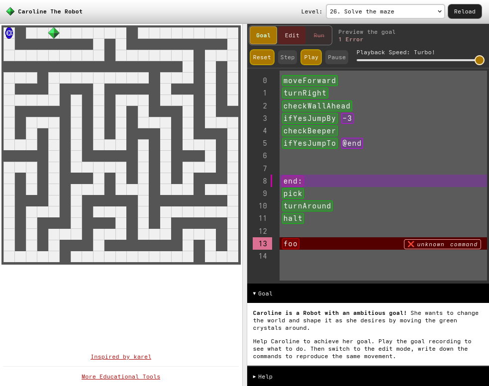

# Caroline the Robot

Learn programming by teaching Caroline the robot to solve various tasks in a two dimensional grid world.

[Live Demo](https://static.laszlokorte.de/robot)

This project is [inspired by Karel](https://github.com/fredoverflow/karel) which in turn is inspired by [Professor Richard E. Pattis](https://compedu.stanford.edu/karel-reader/docs/python/en/chapter1.html).
